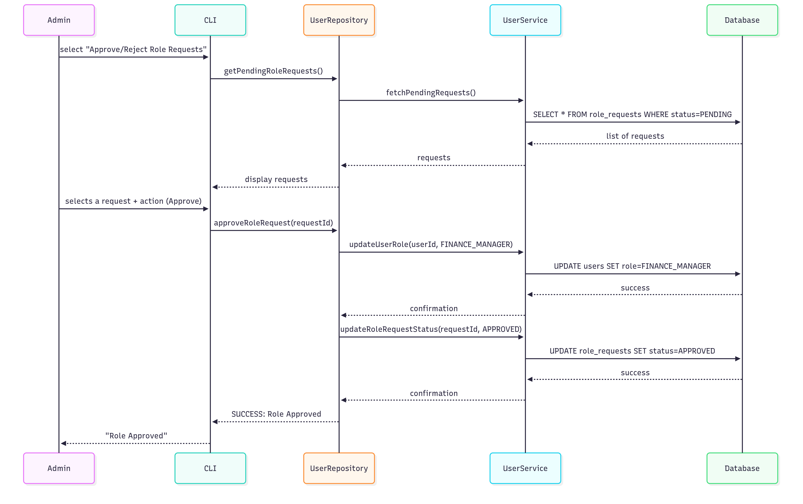

# Payments Management System - UML Diagrams Documentation

## Overview

This document contains the UML diagrams for the Payments Management System, including Entity Relationship (ER) Diagram, Class Diagram, and Sequence Diagrams for core workflows.

## 1. Entity Relationship (ER) Diagram

The ER diagram shows the database structure and relationships between entities:

### Key Entities:

- **users**: Stores user account information
- **roles**: Defines available system roles (ADMIN, FINANCE_MANAGER, VIEWER)
- **user_roles**: Many-to-many relationship between users and roles
- **payments**: Payment transaction records
- **reports**: Generated report metadata
- **audit_trail**: Complete transaction history
- **role_requests**: User requests for role changes
- **bank_accounts**: Bank account information
- **counterparties**: External entities for payments

### Relationships:

- Users can have multiple roles (many-to-many)
- Payments are created by users (many-to-one)
- Reports reference payment data (one-to-many)
- Audit trail tracks all user actions (one-to-many)

## 2. Class Diagram

The class diagram focuses on services, entities, and DTOs:

### Package Structure:

### Key Classes:

#### Entity Classes:
- **User**: User account information with authentication
- **Payment**: Payment transaction with status tracking
- **Report**: Generated report metadata
- **Role**: System role definition
- **AuditTrail**: Transaction history tracking

#### Service Classes:
- **UserService**: User management and authentication
- **PaymentService**: Payment creation and updates
- **ReportService**: Report generation and management
- **LookupService**: Data lookup operations

#### DTO Classes:
- **PaymentDTO**: Data transfer for payment operations
- **PaymentView**: Read-only payment display
- **ReportDTO**: Report data transfer

#### Controller Classes:
- **AdminController**: Admin-specific operations
- **ManagerController**: Finance manager operations
- **ViewerController**: Read-only operations
- **PaymentController**: Payment management

#### Repository Classes:
- **UserRepository**: User data access interface
- **PaymentRepository**: Payment data access interface
- **AuditRepository**: Audit trail data access

## 3. Sequence Diagrams

### 3.1 Add Payment Flow

**Flow Description:**
1. User (Finance Manager) initiates payment creation
2. Controller validates user authorization
3. Service layer validates business rules
4. Repository saves payment to database
5. Audit trail records the transaction
6. Success response returned to user

### 3.2 Update Payment Status Flow

**Flow Description:**
1. User requests status update
2. System validates user permissions
3. Payment status is updated in database
4. Audit trail records the change
5. Updated payment information returned

### 3.3 Generate Report Flow

**Flow Description:**
1. Finance Manager requests report generation
2. System validates user permissions
3. Service queries payment data for specified period
4. Report is generated and formatted
5. Report saved to file system and database
6. Report metadata returned to user

### 3.4 Admin User Management Flow

**Flow Description:**
1. Admin accesses user management
2. System validates admin permissions
3. Admin assigns roles to users
4. Role changes are saved to database
5. Audit trail records role changes
6. Success confirmation returned

## 4. Use Case Diagram

### Primary Actors:
- **Admin**: Full system access
- **Finance Manager**: Payment and report management
- **Viewer**: Read-only access

### Core Use Cases:

#### Admin Use Cases:
- Manage Users
- Assign Roles
- Review Role Requests
- View All Reports
- Access Audit Trail

#### Finance Manager Use Cases:
- Create Payments
- Update Payment Status
- Generate Reports
- View Payment History
- Manage Counterparties

#### Viewer Use Cases:
- View Payments
- View Reports
- View Own Profile

## 5. Activity Diagrams

### Payment Processing Workflow:

1. **Payment Creation**:
    - Validate user permissions
    - Create payment record
    - Set status to PENDING
    - Log in audit trail

2. **Status Updates**:
    - PENDING → PROCESSING → COMPLETED
    - Each transition logged
    - Notifications sent (if configured)

3. **Report Generation**:
    - Select date range
    - Query payment data
    - Calculate totals
    - Generate formatted report
    - Save to file system

## 6. Component Diagram

### System Components:

- **Presentation Layer**: Console UI, Controllers
- **Business Layer**: Services, DTOs
- **Data Access Layer**: Repositories, Database Config
- **Database Layer**: PostgreSQL Database
- **Utility Layer**: Logging, UI helpers

## 7. Deployment Diagram

### Runtime Environment:

- **Application Server**: JVM with Java 17
- **Database Server**: PostgreSQL
- **File System**: Report storage
- **Log Files**: Application logging

## Diagram Quality Standards

All diagrams follow UML 2.0 standards with:

- **Clarity**: Clear notation and labeling
- **Completeness**: All major components included
- **Consistency**: Uniform styling and notation
- **Alignment**: Diagrams match actual implementation

## Tools Used

- **Mermaidchart**: For creating UML diagrams
- **PlantUML**: For sequence diagrams (alternative)
- **Dbdiagram.io**: For ER diagrams

## Conclusion

These UML diagrams provide a comprehensive view of the Payments Management System architecture, from high-level system design to detailed interaction flows. They serve as both documentation and design validation, ensuring the system meets all functional and non-functional requirements.